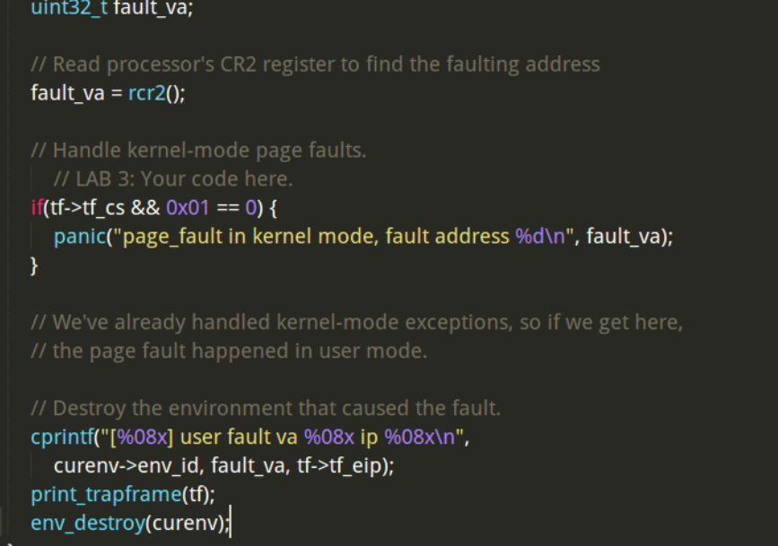
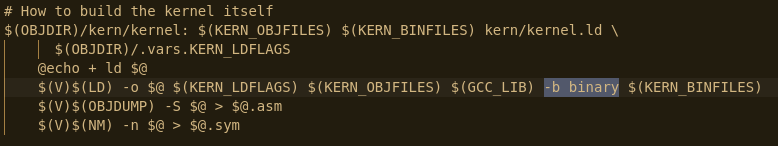
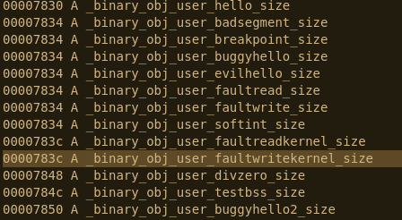
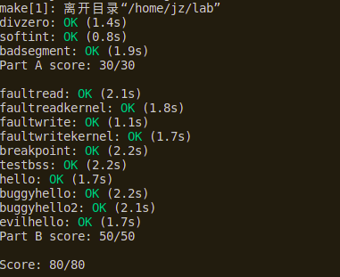

[TOC]

# 黄希报告和总结

## **练习 1.**

**修改 `kern/pmap.c` 中的 `mem_init()` 函数来 分配 并 映射 `envs` 数组。这个数组恰好包含 `NENV` 个 `Env` 结构体实例，这与你分配 `pages` 数组的方式非常相似。另一个相似之处是，支持 `envs` 的内存储应该被只读映射在页表中 `UENVS` 的位置（于 `inc/memlayout.h` 中定义），所以，用户进程可以从这一数组读取数据。**

**答：**找到代码中对应的位置，注释提示`// Make 'envs' point to an array of size 'NENV' of 'struct Env'.`，可以知道要分配一个NEBV数量的Env数组，代码：


随后将其映射到 `UENVS` 处，并设置用户权限为可读：


映射完成后，内存布局如下：


## **练习 2.**

**在 `env.c` 中，完成接下来的这些函数：**

- **`env_init()` 初始化全部 `envs` 数组中的 `Env` 结构体，并将它们加入到 `env_free_list` 中。还要调用 `env_init_percpu` ，这个函数会通过配置段硬件，将其分隔为特权等级 0 (内核) 和特权等级 3（用户）两个不同的段。**
- **`env_setup_vm()` 为新的进程分配一个页目录，并初始化新进程的地址空间对应的内核部分。**
- **`region_alloc()` 为进程分配和映射物理内存。**
- **`load_icode()` 你需要处理 ELF 二进制映像，就像是引导加载程序(boot loader)已经做好的那样，并将映像内容读入新进程的用户地址空间。**
- **`env_create()` 通过调用 `env_alloc` 分配一个新进程，并调用 `load_icode` 读入 ELF 二进制映像。**
- **`env_run()` 启动给定的在用户模式运行的进程。**

**答：**   

1、**`env_init()`**初始化就是对envs数组中的每个Env结构， env_id 字段置0 ，env_status置为ENV_FREE，加入到`env_free_list` 中，使用前插法从后往前遍历可一次性完成初始化和插入操作：


`env_init_percpu()`用内联汇编对段寄存器赋值，实现对不同段设置特权等级，其中GS和FS段设置特权等级为3，为用户数据段。

2、 **`env_setup_vm()`** 为当前进程分配一个页目录，这个页目录继承内核页目录的内容，将其中的UVPT映射改为映射到当前进程的页目录即e->env_pgdir，并设置权限为只读即可：


3、 **`region_alloc()`** 为进程分配和映射物理内存。 如注释中所说，将起始地址va 向下对齐，结束地址va+len向上对齐，然后这段区域内挨个分配物理页，使用 `page_insert` 将分配的物理页添加到该进程的页目录表中，实现对物理页的映射，同时设置权限为可读写：


4、 **`load_icode()`** 通过参数传进了用户进程指针和可执行用户代码的起始地址，先判断该文件是否是ELF文件，不是则报错。 通过`ELFHDR->e_phoff`获取程序头距离ELF文件的偏移，让`ph`指向程序头的起始位置，  程序头记录了有哪些Segment需要加载，加载到线性地址的何处 。 用`ph_num`保存总共有多少Segment。遍历`ph`数组，分配线性地址`p_va`开始的`p_memsz`大小的空间，并将ELF文件中`binary + ph[i].p_offset`偏移处的Segment拷贝到线性地址`p_va`处，这样即将ELF中的段拷贝到了用户的地址空间内。最后将该进程的`tf_eip`设为程序入口，为该进程分配一页的栈空间：


5、 **`env_create()`** ，有了前面的两个函数， **`env_create()`** 实现很简单。调用`env_alloc`分配一个新进程，调用`load_icode`将ELF文件读进来，最后将`env_type` 设置成传进来的type即可： 

    void
    env_create(uint8_t *binary, size_t size, enum EnvType type)
    {
    	// LAB 3: Your code here.
    	struct Env *e;
        int r;
        if ((r = env_alloc(&e, 0) != 0)) {
            panic("create env failed\n");
    }
    load_icode(e, binary);
    e->env_type = type;
    }
6、 **`env_run()`** ： 首先判断是否是进程切换，如果是的话要把原进程置为 `ENV_RUNNABLE` 。设置curenv为传进来的进程，然后修改e->env_status，e->env_runs两个字段。
 接着加载线性地址空间，最后将e->env_tf结构中的寄存器值弹出到寄存器，这样就会从新的%eip地址处读取指令进行解析。 


`Trapframe`结构和env_pop_tf()函数如下：

```
struct PushRegs {
    /* registers as pushed by pusha */
    uint32_t reg_edi;
    uint32_t reg_esi;
    uint32_t reg_ebp;
    uint32_t reg_oesp;      /* Useless */
    uint32_t reg_ebx;
    uint32_t reg_edx;
    uint32_t reg_ecx;
    uint32_t reg_eax;
} __attribute__((packed));

struct Trapframe {
    struct PushRegs tf_regs;
    uint16_t tf_es;
    uint16_t tf_padding1;
    uint16_t tf_ds;
    uint16_t tf_padding2;
    uint32_t tf_trapno;
    /* below here defined by x86 hardware */
    uint32_t tf_err;
    uintptr_t tf_eip;
    uint16_t tf_cs;
    uint16_t tf_padding3;
    uint32_t tf_eflags;
    /* below here only when crossing rings, such as from user to kernel */
    uintptr_t tf_esp;
    uint16_t tf_ss;
    uint16_t tf_padding4;
} __attribute__((packed));

// Restores the register values in the Trapframe with the 'iret' instruction.
// This exits the kernel and starts executing some environment's code.
//
// This function does not return.
//
void
env_pop_tf(struct Trapframe *tf)
{
    asm volatile(
        "\tmovl %0,%%esp\n"             //将%esp指向tf地址处
        "\tpopal\n"                     //弹出Trapframe结构中的tf_regs值到通用寄存器
        "\tpopl %%es\n"                 //弹出Trapframe结构中的tf_es值到%es寄存器
        "\tpopl %%ds\n"                 //弹出Trapframe结构中的tf_ds值到%ds寄存器
        "\taddl $0x8,%%esp\n" /* skip tf_trapno and tf_errcode */
        "\tiret\n"                      //中断返回指令，具体动作如下：从Trapframe结构中依次弹出tf_eip,tf_cs,tf_eflags,tf_esp,tf_ss到相应寄存器
        : : "g" (tf) : "memory");
    panic("iret failed");  /* mostly to placate the compiler */
}
```

 `PushRegs`结构保存的是通用寄存器的值，`env_pop_tf`()第一条指令，将将%esp指向tf地址处，也就是将栈顶指向`Trapframe`结构开始处，`Trapframe`结构开始处正是一个`PushRegs`结构，`popal`将`PushRegs`结构中保存的通用寄存器值弹出到寄存器中，接着按顺序弹出寄存器%es, %ds。最后执行`iret`指令，该指令是中断返回指令，具体动作如下：从Trapframe结构中依次弹出tf_eip,tf_cs,tf_eflags,tf_esp,tf_ss到相应寄存器。和`Trapframe`结构从上往下是一致的。 

## **练习 4.** 

- **将一些值压栈，使栈帧看起来像是一个 `struct Trapframe`**
- **将 `GD_KD` 读入 `%ds` 和 `%es`**
- **`push %esp` 来传递一个指向这个 `Trapframe` 的指针，作为传给 `trap()` 的参数**
- **`call trap` （思考：`trap` 这个函数会返回吗？）**

`Trapframe`的结构上面已经给出。如注释中所说， TRAPHANDLER  和TRAPHANDLER_NOEC宏 用来创建中断处理函数，区别是有无错误代码需要压栈，先创建中断处理函数：


这些函数都会跳转到`_alltraps`。`Trapframe`中  。

```c
  /* below here defined by x86 hardware */
    uint32_t tf_err;
    uintptr_t tf_eip;
    uint16_t tf_cs;
    uint16_t tf_padding3;
    uint32_t tf_eflags;
```

这些寄存器在中断发生时由处理器压入，所以只需要压入剩下的%ds,%es和通用寄存器，最后将%esp压栈即可跳转，所以_alltraps代码：


如此，倒序将`Trapframe`中的寄存器压栈，栈帧就像是一个`Trapframe`了，同时通过压栈出栈将`GD_KD` 

读入了 `%ds` 和 `%es`。

下面 修改 `trap_init()` 来初始化 `IDT` ：

在在inc/mmu.h中定义了SETGATE：

```
#define SETGATE(gate, istrap, sel, off, dpl)            \
{                               \
    (gate).gd_off_15_0 = (uint32_t) (off) & 0xffff;     \
    (gate).gd_sel = (sel);                  \
    (gate).gd_args = 0;                 \
    (gate).gd_rsv1 = 0;                 \
    (gate).gd_type = (istrap) ? STS_TG32 : STS_IG32;    \
    (gate).gd_s = 0;                    \
    (gate).gd_dpl = (dpl);                  \
    (gate).gd_p = 1;                    \
    (gate).gd_off_31_16 = (uint32_t) (off) >> 16;       \
}
```

在trap.c中用其来 修改trap_init()： 

```
void
trap_init(void)
{
    extern struct Segdesc gdt[];

    // LAB 3: Your code here.
    void th0();
    void th1();
    void th3();
    void th4();
    void th5();
    void th6();
    void th7();
    void th8();
    void th9();
    void th10();
    void th11();
    void th12();
    void th13();
    void th14();
    void th16();
    void th_syscall();
    SETGATE(idt[0], 0, GD_KT, th0, 0);      //格式如下：SETGATE(gate, istrap, sel, off, dpl)，定义在inc/mmu.h中
    SETGATE(idt[1], 0, GD_KT, th1, 0);  //设置idt[1]，段选择子为内核代码段，段内偏移为th1
    SETGATE(idt[3], 0, GD_KT, th3, 3);
    SETGATE(idt[4], 0, GD_KT, th4, 0);
    SETGATE(idt[5], 0, GD_KT, th5, 0);
    SETGATE(idt[6], 0, GD_KT, th6, 0);
    SETGATE(idt[7], 0, GD_KT, th7, 0);
    SETGATE(idt[8], 0, GD_KT, th8, 0);
    SETGATE(idt[9], 0, GD_KT, th9, 0);
    SETGATE(idt[10], 0, GD_KT, th10, 0);
    SETGATE(idt[11], 0, GD_KT, th11, 0);
    SETGATE(idt[12], 0, GD_KT, th12, 0);
    SETGATE(idt[13], 0, GD_KT, th13, 0);
    SETGATE(idt[14], 0, GD_KT, th14, 0);
    SETGATE(idt[16], 0, GD_KT, th16, 0);

    SETGATE(idt[T_SYSCALL], 0, GD_KT, th_syscall, 3);  

    // Per-CPU setup 
    trap_init_percpu();
}
```

### **问题** 

- **对每一个中断/异常都分别给出中断处理函数的目的是什么？换句话说，如果所有的中断都交给同一个中断处理函数处理，现在我们实现的哪些功能就没办法实现了？**
- **你有没有额外做什么事情让 `user/softint` 这个程序按预期运行？打分脚本希望它产生一个一般保护错(陷阱 13)，可是 `softint` 的代码却发送的是 `int $14`。*为什么* 这个产生了中断向量 13 ？如果内核允许 `softint` 的 `int $14` 指令去调用内核中断向量 14 所对应的的缺页处理函数，会发生什么？**

答：

1、对每个中断、异常分别给出中断异常处理函数，是因为不同的中断、异常需要不同的处理，比如有的中断、异常由程序出错导致，这类中断处理函数会处理错误，并且可能不会返回原程序中，而有些中断例如IO中断则需要返回。

2、当前的系统正在运行在用户态下，特权级为3， `int $14`  对应缺页异常 ，特权级为0。特权级为3的程序不能直接调用特权级为0的程序，会引发一个General Protection Exception，即trap 13。 这样会有安全隐患，用户程序不应管理内存。

## **练习 5.** 

 **修改 `trap_dispatch()`，将缺页异常分发给 `page_fault_handler()`。你现在应该能够让 `make grade` 通过 `faultread`，`faultreadkernel`，`faultwrite` 和 `faultwritekernel` 这些测试了。如果这些中的某一个不能正常工作，你应该找找为什么，并且解决它。记住，你可以用 `make run-x` 或者 `make run-x-nox` 来直接使 JOS 启动某个特定的用户程序。** 

在trap_dispatch()中判断一下是否是缺页异常，然后调用page_fault_handler来处理就可以了：

```
static void
trap_dispatch(struct Trapframe *tf)
{
	// Handle processor exceptions.
	// LAB 3: Your code here.
	 if (tf->tf_trapno == T_PGFLT) {
        page_fault_handler(tf);
        return;
    }
	// Unexpected trap: The user process or the kernel has a bug.
	print_trapframe(tf);
	if (tf->tf_cs == GD_KT)
		panic("unhandled trap in kernel");
	else {
		env_destroy(curenv);
		return;
	}
}
```

GD_KT在memlayout.h中定义：

```assembly
// Global descriptor numbers
#define GD_KT     0x08     // kernel text
#define GD_KD     0x10     // kernel data
#define GD_UT     0x18     // user text
#define GD_UD     0x20     // user data
#define GD_TSS0   0x28     // Task segment selector for CPU 0
```


## 练习 6.**

修改 `trap_dispatch()` 使断点异常唤起内核监视器。现在，你应该能够让 `make grade` 在 `breakpoint` 测试中成功了。

与上一个类似，在trap_dispatch中继续判断断点异常，调用内核监视器即可：

```c
if (tf->tf_trapno == T_BRKPT) {
        monitor(tf);
        return;
    }
```

### **问题**

- **断点那个测试样例可能会生成一个断点异常，或者生成一个一般保护错，这取决你是怎样在 IDT 中初始化它的入口的（换句话说，你是怎样在 `trap_init` 中调用 `SETGATE` 方法的）。为什么？你应该做什么才能让断点异常像上面所说的那样工作？怎样的错误配置会导致一般保护错？**
- **你认为这样的机制意义是什么？尤其要想想测试程序 `user/softint` 的所作所为 / 尤其要考虑一下 `user/softint` 测试程序的行为。**

答：1、断点测试触发断点异常或一般保护错误取决于IDT中设置的DPL，也就是`SETGATE`的最后一个参数。当前程序是用户程序，CPL为3，如果DPL设置为3，那么当前程序有权限去执行这个断点异常响应函数，如果DPL设置为小于3的数，那么当前程序没有权限执行该函数，就会触发一个一般保护错误。

​		2、这里触发了一个缺页错误。因为一旦允许用户自行触发缺页错误，操作系统将会很容易被攻击。

```c
asm volatile("int $14");    // page fault
```

## **练习 7.**

**在内核中断描述符表中为中断向量 `T_SYSCALL` 添加一个处理函数。你需要编辑 `kern/trapentry.S` 和 `kern/trap.c` 的 `trap_init()` 方法。你也需要修改 `trap_dispath()` 来将系统调用中断分发给在 `kern/syscall.c` 中定义的 `syscall()`。确保如果系统调用号不合法，`syscall()` 返回 `-E_INVAL`。你应该读一读并且理解 `lib/syscall.c`（尤其是内联汇编例程）来确定你已经理解了系统调用接口。通过调用相应的内核函数，处理在 `inc/syscall.h` 中定义的所有系统调用。**

首先在 trapentry.S 的IDT中添加`TRAPHANDLER_NOEC(th_syscall, T_SYSCALL)`，在trap.c中添加`SETGATE(idt[T_SYSCALL], 0, GD_KT, th_syscall, 3);` 

在trap.c的trap_dispatch()再加入判断：

```
 if (tf->tf_trapno == T_SYSCALL) { //如果是系统调用，按照前文说的规则，从寄存器中取出系统调用号和五个参数，传给kern/syscall.c中的syscall()，并将返回值保存到tf->tf_regs.reg_eax
        tf->tf_regs.reg_eax = syscall(tf->tf_regs.reg_eax, tf->tf_regs.reg_edx, tf->tf_regs.reg_ecx,
            tf->tf_regs.reg_ebx, tf->tf_regs.reg_edi, tf->tf_regs.reg_esi);
        return;
    }
```

  修改kern/syscall.c中的syscall() ：


## **练习 8.**

**在用户库文件中补全所需要的代码，并启动你的内核。你应该能看到 `user/hello` 打出了 `hello, world` 和 `i am environment 00001000`。接下来，`user/hello` 尝试通过调用 `sys_env_destory()` 方法退出（在 `lib/libmain.c` 和 `lib/exit.c`）。因为内核目前只支持单用户进程，它应该会报告它已经销毁了这个唯一的进程并进入内核监视器。在这时，你应该能够在 `make grade` 中通过 `hello` 这个测试了。**

答：其实这个练习就是通过程序获得当前正在运行的用户环境的 env_id , 以及这个用户环境所对应的 Env 结构体的指针。 env_id 我们可以通过调用 sys_getenvid() 这个函数来获得。通过阅读 lib/env.h  文件我们知道，env_id的值包含三部分，第31位被固定为0；第10~30这21位是标识符，标示这个用户环境；第0~9位代表这个用户环境所采用的 Env 结构体，在envs数组中的索引。所以我们只需知道 env_id 的低 0~9 位，我们就可以获得这个用户环境对应的 Env 结构体了。


## **练习 9.**

**修改 `kern/trap.c`，如果缺页发生在内核模式，应该恐慌。**

 根据 CS 段寄存器的低2位 ，即 CPL 位 可以判断当前进程的权限访问级别，如果 page fault 是出现在内核态时，要把这个事件 panic 出来，所以把 page_fault_handler 文件修改如下： 



 继续完善 kern/pmap.c 文件中的 user_mem_assert , user_mem_check 函数，  user_mem_check 函数的功能是检查一下当前用户态程序是否有对虚拟地址空间 [va, va+len] 的 perm| PTE_P 访问权限。 先找到这个虚拟地址范围对应于当前用户态程序的页表中的页表项，然后再去看一下这个页表项中有关访问权限的字段，是否包含 perm | PTE_P，只要有一个页表项是不包含的，就代表程序对这个范围的虚拟地址没有 perm|PTE_P 的访问权限：


最后还要补全 sys_cputs  函数， 这个函数要求检查用户程序对虚拟地指空间 [s, s+len] 是否有访问权限 ，所以可以利用上面实现的 user_mem_assert ()函数来检查：


# 蒋璋心得体会

##  `kern/pmap.c` 中的 `mem_init()`

```c
envs = (struct Env *)boot_alloc(NENV * sizeof(struct Env));
memset(envs, 0, NENV * sizeof(struct Env));
boot_map_region(kern_pgdir, UENVS, PTSIZE, PADDR(envs), PTE_U);
```

使用bool_alloc()分配NENV大小的空间，并且置0。

在映射到内核虚拟地址UENVS的位置

Makefrag中 -b binary将文件链接成了未经解释的二进制文件




> obj/kern/kernel.sym

出现了许多user中被处理的程序生成的文件




## **`env_init()`**

给分配了空间的envs数组做初始化(其实不需要，因为用memset已经置零了)。将数组中的所有元素加入env_free_list的链表中，因为需要env_free_list的头节点指向envs[0], 因此反向插入节点。

这里有一个神坑，前面的迭代变量i声明都用的size_t，是一个无符号整数。但是这里因为要判断i>=0，所以i必须是有符号的，因此只能用int。如果用size_t将导致死循环。

```c
void env_init(void)
{
        // Set up envs array
        // LAB 3: Your code here.
        env_free_list = NULL;
        int i;
        for (i = NENV - 1; i >= 0; i--)
        {
            // memset 已经置0了，因此不用再写那些置0的操作
            envs[i].env_id = 0;
            envs[i].env_link = env_free_list;
            env_free_list = &envs[i];
        }
        // Per-CPU part of the initialization
        env_init_percpu();
}
```

> env_init_percpu

```c
// Load GDT and segment descriptors.
void env_init_percpu(void)
{
        lgdt(&gdt_pd);
        // The kernel never uses GS or FS, so we leave those set to
        // the user data segment.
        asm volatile("movw %%ax,%%gs" ::"a"(GD_UD | 3));
        asm volatile("movw %%ax,%%fs" ::"a"(GD_UD | 3));
        // The kernel does use ES, DS, and SS.  We'll change between
        // the kernel and user data segments as needed.
        asm volatile("movw %%ax,%%es" ::"a"(GD_KD));
        asm volatile("movw %%ax,%%ds" ::"a"(GD_KD));
        asm volatile("movw %%ax,%%ss" ::"a"(GD_KD));
        // Load the kernel text segment into CS.
        asm volatile("ljmp %0,$1f\n 1:\n" ::"i"(GD_KT));
        // For good measure, clear the local descriptor table (LDT),
        // since we don't use it.
        lldt(0);
}

```

这个用到了内联汇编

这个其实还是看不太懂，不过大概的猜测，%%ax，%%gs ...等等两个%的都是寄存器。::"a"(GD_KT)应该是把GD_KT的值存进寄存器ax中。

大概的作用就是修改 gs fs es ds ss 这四个寄存器。

解释一下几个概念

全局描述表(GDT Global Descriptor Table)

存储全局的段描述符

LDT (Local Descriptor Table)

与GDT不同的是，LDT在系统中可以存在多个，并且从LDT的名字可以得知，LDT不是全局可见的，它们只对引用它们的任务可见，每个任务最多可以拥有一个LDT。另外，每一个LDT自身作为一个段存在，它们的段描述符被放在GDT中。

LGDT

加载全局描述符

LIDT 加载中断描述符

LLDT	加载局部描述符

LMSW  加载状态字


## *`env_setup_vm()`*

```c
	int i;
	struct PageInfo *p = NULL;

	// Allocate a page for the page directory
	if (!(p = page_alloc(ALLOC_ZERO)))
		return -E_NO_MEM;
	
	p->pp_ref++;
	pde_t *page_dir = page2kva(p);
	e->env_pgdir = page_dir;
	//新进程的地址空间对应内核的部分
	memcpy(page_dir, kern_pgdir, PGSIZE);
	// UVPT maps the env's own page table read-only.
	// Permissions: kernel R, user R
	e->env_pgdir[PDX(UVPT)] = PADDR(e->env_pgdir) | PTE_P | PTE_U;

	return 0;
```

首先用boot_alloc 分配一个物理页，然后将这个物理页的虚拟地址作为该进程页目录表的树根，由于新进程的地址空间要对应内核的部分，因此把内核页目录表的内容复制过去。然后把他的权限位置为用户态。


## region_alloc

```c
static void
region_alloc(struct Env *e, void *va, size_t len)
{
	// LAB 3: Your code here.
        struct PageInfo *p;
        void *begin = ROUNDDOWN(va, PGSIZE);
        void *end = ROUNDUP(va + len, PGSIZE);
        while (begin < end)
        {
                p = page_alloc(0);
                if (!p)
                        panic("page fault!\n");
                if (page_insert(e->env_pgdir, p, begin, PTE_U | PTE_W))
                        panic("page insert failed!\n");
                begin += PGSIZE;
        }
}
```

region_alloc实现了为进程分配从虚拟地址va开始，长度为len的一段内存。首先让地址区间向PGSIZE对齐，然后对于其中的每一个页，用page_alloc分配物理页，并调用page_insert函数，将该页加到页表中。

## load_icode

```c
static void
load_icode(struct Env *e, uint8_t *binary)
{
	// LAB 3: Your code here.
        struct Elf *elfhdr = (struct Elf *)binary;
        struct Proghdr *ph, *eph;
        if (elfhdr->e_magic != ELF_MAGIC)
            	panic("elf header's magic is not correct\n");
        ph = (struct Proghdr *)((uint8_t *)elfhdr + elfhdr->e_phoff);
        eph = ph + elfhdr->e_phnum;
        lcr3(PADDR(e->env_pgdir));
        for (; ph < eph; ph++)
        {
                if (ph->p_type != ELF_PROG_LOAD)
                {
                   	 continue;
                }
                if (ph->p_filesz > ph->p_memsz)
                {
                   	 panic("file size is great than memory size\n");
                }
            	// p_va 内存开始的地方, p_memsz内存的长度
                region_alloc(e, (void *)ph->p_va, ph->p_memsz);
            	// p_offset是该段的距离开始的偏移，p_filesz是该段在文件的长度
                memmove((void *)ph->p_va, binary + ph->p_offset, ph->p_filesz);
            	// 剩下的置零即可
                memset((void *)ph->p_va + ph->p_filesz, 0, (ph->p_memsz - ph->p_filesz));
        }
        e->env_tf.tf_eip = elfhdr->e_entry;
        // Now map one page for the program's initial stack
        // at virtual address USTACKTOP - PGSIZE.

        // LAB 3: Your code here.
        lcr3(PADDR(kern_pgdir));
        region_alloc(e, (void *)USTACKTOP - PGSIZE, PGSIZE);
}
```

参照bootmain中载入elf镜像的写法。判断elf->e_magic，如果不等于ELF_MAGIC的话说明载入出错了。

然后通过ELFHDR->e_phoff获取程序头距离ELF文件的偏移，ph指向的就是程序头的起始位置，相当于一个数组，程序头记录了有哪些Segment需要加载，加载到线性地址的何处？ph_num保存了总共有多少Segment。然后ph + e_phnum也集就是文件头结束的位置。然后因为我们要将这些segment拷贝到用户空间而不是内核空间，因此需要先load_cr3把e->pgdir加载进去。

然后就是将各段的内存信息加载到以该进程的页目录表为树根的页表中。

`e->env_tf.tf_eip = ELFHDR->e_entry;`也就是程序第一条指令的位置。然后需要映射栈到用户的地址空间中，把cr3切换成内核地址空间。

## env_create

```c
void env_create(uint8_t *binary, enum EnvType type)
{
        // LAB 3: Your code here.
        struct Env *e;
        int ret = 0;
        if (curenv != 0)
            	ret = env_alloc(&e, curenv->env_id);
        else
        {
            	ret = env_alloc(&e, 0);
        }
        if (ret)
            	panic("env_create failed!\n");
        load_icode(e, binary);
        e->env_type = type;
}
```

用读入的elf文件创建一个进程。首先调用env_alloc分配一个进程。然后用load_icode 加载二进制文件。

## env_run

```c
void env_run(struct Env *e)
{
	// LAB 3: Your code here.
        if (curenv != NULL && curenv->env_status == ENV_RUNNING)
        {
            	curenv->env_status = ENV_RUNNABLE;
        }
        curenv = e;
        e->env_status = ENV_RUNNING;
        e->env_runs++;
        lcr3(PADDR(e->env_pgdir));
        env_pop_tf(&(e->env_tf));
        e->env_type = ENV_TYPE_USER;
        //panic("env_run not yet implemented");
}

```

如果当前存在运行的进程的话将其置为停下来。然后把要运行的进程置为正在运行，加载它的页目录表，然后加载他的寄存器，然后进入用户空间。


然后运行会在int 0x30处停下卡死，然后报一个tripple fault。一开始以为是代码写错了，调试了半天。。。


## 中断的实现和处理

```c
struct Trapframe {
        struct PushRegs tf_regs;
        uint16_t tf_es;
        uint16_t tf_padding1;
        uint16_t tf_ds;
        uint16_t tf_padding2;
        uint32_t tf_trapno;
        /* below here defined by x86 hardware */
        uint32_t tf_err;
        uintptr_t tf_eip;
        uint16_t tf_cs;
        uint16_t tf_padding3;
        uint32_t tf_eflags;
        /* below here only when crossing rings, such as from user to kernel */
        uintptr_t tf_esp;
        uint16_t tf_ss;
        uint16_t tf_padding4;
} __attribute__((packed));
```

首先看一下寄存器的结构，在中断中需要压栈的寄存器只有tf_es，和tf_ds。然后用pusha 压入regs。根据提示把GD_KD 赋值给ds和es，然后压入esp，call trap。

```assembly
_alltraps:
    pushl %ds
    pushl %es
    pushal
    pushl $GD_KD
    popl %ds
    pushl $GD_KD
    popl %es
    pushl %esp  //压入trap()的参数tf，%esp指向Trapframe结构的起始地址
    call trap       //调用trap()函数

```

```assembly
	TRAPHANDLER_NOEC(th0, T_DIVIDE)
    TRAPHANDLER_NOEC(th1, T_DEBUG)
    TRAPHANDLER_NOEC(th2, T_NMI)
    TRAPHANDLER_NOEC(th3, T_BRKPT)
    TRAPHANDLER_NOEC(th4, T_OFLOW)
    TRAPHANDLER_NOEC(th5, T_BOUND)
    TRAPHANDLER_NOEC(th6, T_ILLOP)
    TRAPHANDLER_NOEC(th7, T_DEVICE)
    TRAPHANDLER(th8, T_DBLFLT)
    TRAPHANDLER(th10, T_TSS)
    TRAPHANDLER(th11, T_SEGNP)
    TRAPHANDLER(th12, T_STACK)
    TRAPHANDLER(th13, T_GPFLT)
    TRAPHANDLER(th14, T_PGFLT)
    TRAPHANDLER_NOEC(th16, T_FPERR)
    TRAPHANDLER_NOEC(th_syscall, T_SYSCALL)
```

这里声明每一个中断的入口点。

```c
void trap_init(void)
{
        extern struct Segdesc gdt[];

        // LAB 3: Your code here.
        void th0();
        void th1();
        void th2();
        void th3();
        void th4();
        void th5();
        void th6();
        void th7();
        void th8();
        void th9();
        void th10();
        void th11();
        void th12();
        void th13();
        void th14();
        void th16();
        void th_syscall();
        SETGATE(idt[0], 0, GD_KT, th0, 0); //格式如下：SETGATE(gate, istrap, sel, off, dpl)，定义在inc/mmu.h中
        SETGATE(idt[1], 0, GD_KT, th1, 0); //设置idt[1]，段选择子为内核代码段，段内偏移为th1
        SETGATE(idt[2], 0, GD_KT, th2, 3);
        SETGATE(idt[3], 0, GD_KT, th3, 3);
        SETGATE(idt[4], 0, GD_KT, th4, 0);
        SETGATE(idt[5], 0, GD_KT, th5, 0);
        SETGATE(idt[6], 0, GD_KT, th6, 0);
        SETGATE(idt[7], 0, GD_KT, th7, 0);
        SETGATE(idt[8], 0, GD_KT, th8, 0);
        SETGATE(idt[10], 0, GD_KT, th10, 0);
        SETGATE(idt[11], 0, GD_KT, th11, 0);
        SETGATE(idt[12], 0, GD_KT, th12, 0);
        SETGATE(idt[13], 0, GD_KT, th13, 0);
        SETGATE(idt[14], 0, GD_KT, th14, 0);
        SETGATE(idt[16], 0, GD_KT, th16, 0);

        SETGATE(idt[T_SYSCALL], 0, GD_KT, th_syscall, 3); //为什么门的DPL要定义为3，参考《x86汇编语言-从实模式到保护模式》p345
        // Per-CPU setup
        trap_init_percpu();
}
```

然后这里是初始化idt表。


page_fault

```c
case T_PGFLT:
		page_fault_handler(tf);
		return;
```

断点

```c
case T_BRKPT:
		monitor(tf);
		return;
```

系统调用

```c
case T_SYSCALL:
		tf->tf_regs.reg_eax = syscall(tf->tf_regs.reg_eax,
									  tf->tf_regs.reg_edx,
									  tf->tf_regs.reg_ecx,
									  tf->tf_regs.reg_ebx,
									  tf->tf_regs.reg_edi,
									  tf->tf_regs.reg_esi);
		return;
```


当处理器发生缺页时，它将造成缺页的线性(或者说，虚拟)地址存储在一个特别的处理器控制寄存器 `CR2` 中。

```c
void page_fault_handler(struct Trapframe *tf)
{
        uint32_t fault_va;
        // Read processor's CR2 register to find the faulting address
        fault_va = rcr2();
        // Handle kernel-mode page faults.
        // LAB 3: Your code here.
        if ((tf->tf_cs & 3) == 0)
            	panic("page fault in kernel!\n");
        // We've already handled kernel-mode exceptions, so if we get here,
        // the page fault happened in user mode.

        // Destroy the environment that caused the fault.
        cprintf("[%08x] user fault va %08x ip %08x\n",
                curenv->env_id, fault_va, tf->tf_eip);
        print_trapframe(tf);
        env_destroy(curenv);
}
```


**问题**


- 你认为这样的机制意义是什么？尤其要想想测试程序 `user/softint` 的所作所为 / 尤其要考虑一下 `user/softint` 测试程序的行为。

这里触发了一个缺页错误。因为一旦允许用户自行触发缺页错误，操作系统将会很容易被攻击。

```c
asm volatile("int $14");    // page fault
```


## **挑战！**

修改你的 JOS 内核，让你能够在断点之后从当前位置恢复运行，或者在断点之后继续单步运行。你需要理解 `EFLAGS` 中的某个特定的位来实现单步运行。

首先调整一下trap_dispatch()

```c
case T_BRKPT:
case T_DEBUG:
		monitor(tf);
		return;
```

让debug和breakpoint两种都能被捕捉到


然后这之后就会进入monitor中

```c
void monitor(struct Trapframe *tf)
{
        char *buf;

        cprintf("Welcome to the JOS kernel monitor!\n");
        cprintf("Type 'help' for a list of commands.\n");

        if (tf != NULL)
            print_trapframe(tf);

        while (1)
        {
            buf = readline("K> ");
            if (buf != NULL)
                if (runcmd(buf, tf) < 0)
                    break;
        }
}
```

我们来看看monitor的定义，如果tf不为空，那么说明当前监视器位于debug状态，会打印信息。然后在这时如果我们需要debug，需要编写两个函数

```c
int mon_continue(int argc, char **argv, struct Trapframe *tf)
{
        //关于EFLAGS寄存器的部分，发现了一个位：Trap Bit.
        //如果这个位被设置位1，那么每次执行一条指令，都会自动触发一次Debug Exception.
        if (tf == NULL)
        {
            cprintf("No Env is Running! This is Not a Debug Monitor!\n");
            return 0;
        }
        // Because we want the program to continue running; clear the TF bit
        tf->tf_eflags &= ~(FL_TF);
        return -1;
}
```

```c
int mon_stepi(int argc, char **argv, struct Trapframe *tf)
{
        if (tf == NULL)
        {
            cprintf("No Env is Running! This is Not a Debug Monitor!\n");
            return 0;
        }
        // Because we want the program to single step, set the TF bit
        tf->tf_eflags |= (FL_TF);
        return -1;
}

```

首先我们需要了解EFLAGS这个寄存器。这个寄存器中有Trap Bit.如果这个位被设置位1，那么每次执行一条指令，都会自动触发一次Debug Exception.因此我们要做的也很简单，在单步调试时给这一位置位，继续时把这一位清掉即可。

然后是在commands中添加函数入口，可以在monitor中输入

```c
static struct Command commands[] = {
        {"help", "Display this list of commands or one of the command", "help\nhelp <command>", mon_help},
        {"kerninfo", "Display information about the kernel", "kerninfo", mon_kerninfo},
        {"backtrace", "Display backtrace info", "backtrace", mon_backtrace},
        {"showmappings", "Display the permission of the vaddr between begin and end", "showmappings <begin> <end>", mon_showmapping},
        {"setperm", "set the permission of the virtual address bewteen begin and end",
         "setperm <begin> <end> <perm>", mon_setPrivilege},
        {"dump", "Display the contents between begin and end", "dump -p/-v <begin> <end>", mon_dump},
        {"stepi", "step", "stedpi", mon_stepi},
        {"continue", "continue", "continue", mon_continue},
};
```

运行效果如下：

我们使用make run-breakpoint


然后stepi


可以看到触发了debug但是还在调试模式中。


输入continue




最后结果

