# **lab 3 实验报告和总结**

[TOC]

## **练习 1.**

**修改 `kern/pmap.c` 中的 `mem_init()` 函数来 分配 并 映射 `envs` 数组。这个数组恰好包含 `NENV` 个 `Env` 结构体实例，这与你分配 `pages` 数组的方式非常相似。另一个相似之处是，支持 `envs` 的内存储应该被只读映射在页表中 `UENVS` 的位置（于 `inc/memlayout.h` 中定义），所以，用户进程可以从这一数组读取数据。**

**答：**找到代码中对应的位置，注释提示`// Make 'envs' point to an array of size 'NENV' of 'struct Env'.`，可以知道要分配一个NEBV数量的Env数组，代码：

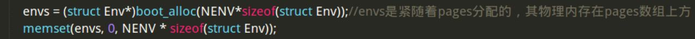

随后将其映射到 `UENVS` 处，并设置用户权限为可读：

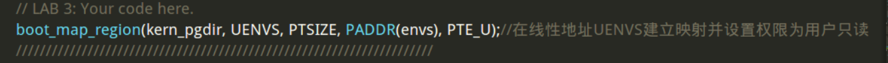

映射完成后，内存布局如下：

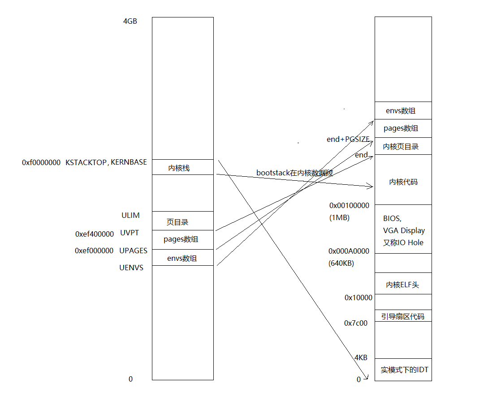

## **练习 2.**

**在 `env.c` 中，完成接下来的这些函数：**

- **`env_init()` 初始化全部 `envs` 数组中的 `Env` 结构体，并将它们加入到 `env_free_list` 中。还要调用 `env_init_percpu` ，这个函数会通过配置段硬件，将其分隔为特权等级 0 (内核) 和特权等级 3（用户）两个不同的段。**
- **`env_setup_vm()` 为新的进程分配一个页目录，并初始化新进程的地址空间对应的内核部分。**
- **`region_alloc()` 为进程分配和映射物理内存。**
- **`load_icode()` 你需要处理 ELF 二进制映像，就像是引导加载程序(boot loader)已经做好的那样，并将映像内容读入新进程的用户地址空间。**
- **`env_create()` 通过调用 `env_alloc` 分配一个新进程，并调用 `load_icode` 读入 ELF 二进制映像。**
- **`env_run()` 启动给定的在用户模式运行的进程。**

**答：**   

1、**`env_init()`**初始化就是对envs数组中的每个Env结构， env_id 字段置0 ，env_status置为ENV_FREE，加入到`env_free_list` 中，使用前插法从后往前遍历可一次性完成初始化和插入操作：

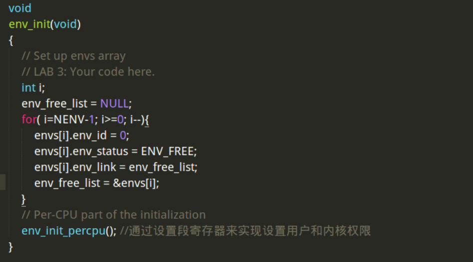

`env_init_percpu()`用内联汇编对段寄存器赋值，实现对不同段设置特权等级，其中GS和FS段设置特权等级为3，为用户数据段。

2、 **`env_setup_vm()`** 为当前进程分配一个页目录，这个页目录继承内核页目录的内容，将其中的UVPT映射改为映射到当前进程的页目录即e->env_pgdir，并设置权限为只读即可：

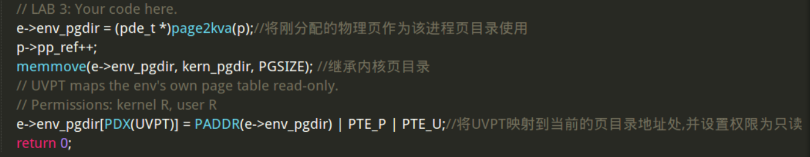

3、 **`region_alloc()`** 为进程分配和映射物理内存。 如注释中所说，将起始地址va 向下对齐，结束地址va+len向上对齐，然后这段区域内挨个分配物理页，使用 `page_insert` 将分配的物理页添加到该进程的页目录表中，实现对物理页的映射，同时设置权限为可读写：


4、 **`load_icode()`** 通过参数传进了用户进程指针和可执行用户代码的起始地址，先判断该文件是否是ELF文件，不是则报错。 通过`ELFHDR->e_phoff`获取程序头距离ELF文件的偏移，让`ph`指向程序头的起始位置，  程序头记录了有哪些Segment需要加载，加载到线性地址的何处 。 用`ph_num`保存总共有多少Segment。遍历`ph`数组，分配线性地址`p_va`开始的`p_memsz`大小的空间，并将ELF文件中`binary + ph[i].p_offset`偏移处的Segment拷贝到线性地址`p_va`处，这样即将ELF中的段拷贝到了用户的地址空间内。最后将该进程的`tf_eip`设为程序入口，为该进程分配一页的栈空间：

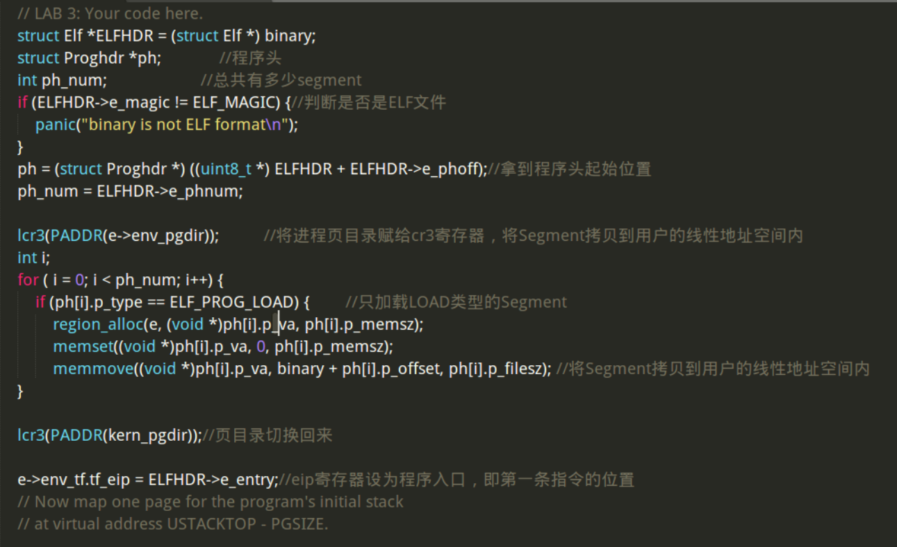

5、 **`env_create()`** ，有了前面的两个函数， **`env_create()`** 实现很简单。调用`env_alloc`分配一个新进程，调用`load_icode`将ELF文件读进来，最后将`env_type` 设置成传进来的type即可： 

    void
    env_create(uint8_t *binary, size_t size, enum EnvType type)
    {
    	// LAB 3: Your code here.
    	struct Env *e;
        int r;
        if ((r = env_alloc(&e, 0) != 0)) {
            panic("create env failed\n");
    }
    load_icode(e, binary);
    e->env_type = type;
    }
6、 **`env_run()`** ： 首先判断是否是进程切换，如果是的话要把原进程置为 `ENV_RUNNABLE` 。设置curenv为传进来的进程，然后修改e->env_status，e->env_runs两个字段。
 接着加载线性地址空间，最后将e->env_tf结构中的寄存器值弹出到寄存器，这样就会从新的%eip地址处读取指令进行解析。 

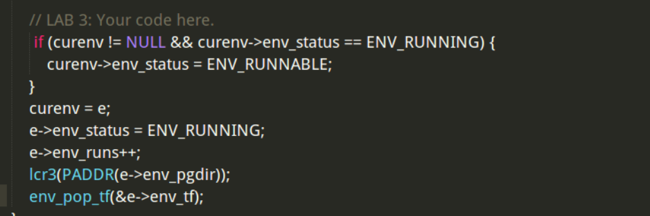

`Trapframe`结构和env_pop_tf()函数如下：

```
struct PushRegs {
    /* registers as pushed by pusha */
    uint32_t reg_edi;
    uint32_t reg_esi;
    uint32_t reg_ebp;
    uint32_t reg_oesp;      /* Useless */
    uint32_t reg_ebx;
    uint32_t reg_edx;
    uint32_t reg_ecx;
    uint32_t reg_eax;
} __attribute__((packed));

struct Trapframe {
    struct PushRegs tf_regs;
    uint16_t tf_es;
    uint16_t tf_padding1;
    uint16_t tf_ds;
    uint16_t tf_padding2;
    uint32_t tf_trapno;
    /* below here defined by x86 hardware */
    uint32_t tf_err;
    uintptr_t tf_eip;
    uint16_t tf_cs;
    uint16_t tf_padding3;
    uint32_t tf_eflags;
    /* below here only when crossing rings, such as from user to kernel */
    uintptr_t tf_esp;
    uint16_t tf_ss;
    uint16_t tf_padding4;
} __attribute__((packed));

// Restores the register values in the Trapframe with the 'iret' instruction.
// This exits the kernel and starts executing some environment's code.
//
// This function does not return.
//
void
env_pop_tf(struct Trapframe *tf)
{
    asm volatile(
        "\tmovl %0,%%esp\n"             //将%esp指向tf地址处
        "\tpopal\n"                     //弹出Trapframe结构中的tf_regs值到通用寄存器
        "\tpopl %%es\n"                 //弹出Trapframe结构中的tf_es值到%es寄存器
        "\tpopl %%ds\n"                 //弹出Trapframe结构中的tf_ds值到%ds寄存器
        "\taddl $0x8,%%esp\n" /* skip tf_trapno and tf_errcode */
        "\tiret\n"                      //中断返回指令，具体动作如下：从Trapframe结构中依次弹出tf_eip,tf_cs,tf_eflags,tf_esp,tf_ss到相应寄存器
        : : "g" (tf) : "memory");
    panic("iret failed");  /* mostly to placate the compiler */
}
```

 `PushRegs`结构保存的是通用寄存器的值，`env_pop_tf`()第一条指令，将将%esp指向tf地址处，也就是将栈顶指向`Trapframe`结构开始处，`Trapframe`结构开始处正是一个`PushRegs`结构，`popal`将`PushRegs`结构中保存的通用寄存器值弹出到寄存器中，接着按顺序弹出寄存器%es, %ds。最后执行`iret`指令，该指令是中断返回指令，具体动作如下：从`Trapframe`结构中依次弹出`tf_eip`,`tf_cs`,`tf_eflags`,`tf_esp`,`tf_ss`到相应寄存器。和`Trapframe`结构从上往下是一致的。 

## **练习 4.** 

- **将一些值压栈，使栈帧看起来像是一个 `struct Trapframe`**
- **将 `GD_KD` 读入 `%ds` 和 `%es`**
- **`push %esp` 来传递一个指向这个 `Trapframe` 的指针，作为传给 `trap()` 的参数**
- **`call trap` （思考：`trap` 这个函数会返回吗？）**

`Trapframe`的结构上面已经给出。如注释中所说， `TRAPHANDLER`  和`TRAPHANDLER_NOEC`宏 用来创建中断处理函数，区别是有无错误代码需要压栈，先创建中断处理函数：

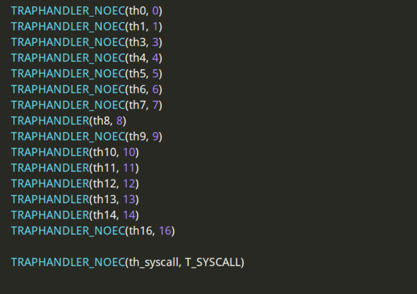

这些函数都会跳转到`_alltraps`。`Trapframe`中  。

```c
  /* below here defined by x86 hardware */
    uint32_t tf_err;
    uintptr_t tf_eip;
    uint16_t tf_cs;
    uint16_t tf_padding3;
    uint32_t tf_eflags;
```

这些寄存器在中断发生时由处理器压入，所以只需要压入剩下的%ds,%es和通用寄存器，最后将%esp压栈即可跳转，所以`_alltraps`代码：

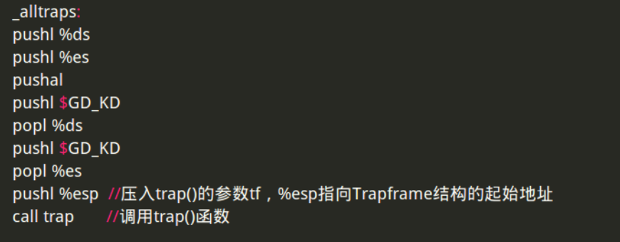

如此，倒序将`Trapframe`中的寄存器压栈，栈帧就像是一个`Trapframe`了，同时通过压栈出栈将`GD_KD` 

读入了 `%ds` 和 `%es`。

下面 修改 `trap_init()` 来初始化 `IDT` ：

在`inc/mmu.h`中定义了`SETGATE`：

```
#define SETGATE(gate, istrap, sel, off, dpl)            \
{                               \
    (gate).gd_off_15_0 = (uint32_t) (off) & 0xffff;     \
    (gate).gd_sel = (sel);                  \
    (gate).gd_args = 0;                 \
    (gate).gd_rsv1 = 0;                 \
    (gate).gd_type = (istrap) ? STS_TG32 : STS_IG32;    \
    (gate).gd_s = 0;                    \
    (gate).gd_dpl = (dpl);                  \
    (gate).gd_p = 1;                    \
    (gate).gd_off_31_16 = (uint32_t) (off) >> 16;       \
}
```

在`trap.c`中用其来 修改`trap_init()`： 

```
void
trap_init(void)
{
    extern struct Segdesc gdt[];

    // LAB 3: Your code here.
    SETGATE(idt[0], 0, GD_KT, th0, 0);      //格式如下：SETGATE(gate, istrap, sel, off, dpl)，定义在inc/mmu.h中
    SETGATE(idt[1], 0, GD_KT, th1, 0);  //设置idt[1]，段选择子为内核代码段，段内偏移为th1
    SETGATE(idt[3], 0, GD_KT, th3, 3);
    SETGATE(idt[4], 0, GD_KT, th4, 0);
    SETGATE(idt[5], 0, GD_KT, th5, 0);
    SETGATE(idt[6], 0, GD_KT, th6, 0);
    SETGATE(idt[7], 0, GD_KT, th7, 0);
    SETGATE(idt[8], 0, GD_KT, th8, 0);
    SETGATE(idt[9], 0, GD_KT, th9, 0);
    SETGATE(idt[10], 0, GD_KT, th10, 0);
    SETGATE(idt[11], 0, GD_KT, th11, 0);
    SETGATE(idt[12], 0, GD_KT, th12, 0);
    SETGATE(idt[13], 0, GD_KT, th13, 0);
    SETGATE(idt[14], 0, GD_KT, th14, 0);
    SETGATE(idt[16], 0, GD_KT, th16, 0);

    SETGATE(idt[T_SYSCALL], 0, GD_KT, th_syscall, 3);  

    // Per-CPU setup 
    trap_init_percpu();
}
```

### **问题** 

- **对每一个中断/异常都分别给出中断处理函数的目的是什么？换句话说，如果所有的中断都交给同一个中断处理函数处理，现在我们实现的哪些功能就没办法实现了？**
- **你有没有额外做什么事情让 `user/softint` 这个程序按预期运行？打分脚本希望它产生一个一般保护错(陷阱 13)，可是 `softint` 的代码却发送的是 `int $14`。*为什么* 这个产生了中断向量 13 ？如果内核允许 `softint` 的 `int $14` 指令去调用内核中断向量 14 所对应的的缺页处理函数，会发生什么？**

答：

1、对每个中断、异常分别给出中断异常处理函数，是因为不同的中断、异常需要不同的处理，比如有的中断、异常由程序出错导致，这类中断处理函数会处理错误，并且可能不会返回原程序中，而有些中断例如IO中断则需要返回。

2、当前的系统正在运行在用户态下，特权级为3， `int $14`  对应缺页异常 ，特权级为0。特权级为3的程序不能直接调用特权级为0的程序，会引发一个General Protection Exception，即trap 13。 这样会有安全隐患，用户程序不应管理内存。

## **练习 5.** 

 **修改 `trap_dispatch()`，将缺页异常分发给 `page_fault_handler()`。你现在应该能够让 `make grade` 通过 `faultread`，`faultreadkernel`，`faultwrite` 和 `faultwritekernel` 这些测试了。如果这些中的某一个不能正常工作，你应该找找为什么，并且解决它。记住，你可以用 `make run-x` 或者 `make run-x-nox` 来直接使 JOS 启动某个特定的用户程序。** 

在trap_dispatch()中判断一下是否是缺页异常，然后调用page_fault_handler来处理就可以了：

```
static void
trap_dispatch(struct Trapframe *tf)
{
	// Handle processor exceptions.
	// LAB 3: Your code here.
	 if (tf->tf_trapno == T_PGFLT) {
        page_fault_handler(tf);
        return;
    }
	// Unexpected trap: The user process or the kernel has a bug.
	print_trapframe(tf);
	if (tf->tf_cs == GD_KT)
		panic("unhandled trap in kernel");
	else {
		env_destroy(curenv);
		return;
	}
}
```

GD_KT在memlayout.h中定义：

```assembly
// Global descriptor numbers
#define GD_KT     0x08     // kernel text
#define GD_KD     0x10     // kernel data
#define GD_UT     0x18     // user text
#define GD_UD     0x20     // user data
#define GD_TSS0   0x28     // Task segment selector for CPU 0
```


## **练习 6.**

修改 `trap_dispatch()` 使断点异常唤起内核监视器。现在，你应该能够让 `make grade` 在 `breakpoint` 测试中成功了。

与上一个类似，在trap_dispatch中继续判断断点异常，调用内核监视器即可：

```c
if (tf->tf_trapno == T_BRKPT) {
        monitor(tf);
        return;
    }
```

### **问题**

- **断点那个测试样例可能会生成一个断点异常，或者生成一个一般保护错，这取决你是怎样在 IDT 中初始化它的入口的（换句话说，你是怎样在 `trap_init` 中调用 `SETGATE` 方法的）。为什么？你应该做什么才能让断点异常像上面所说的那样工作？怎样的错误配置会导致一般保护错？**
- **你认为这样的机制意义是什么？尤其要想想测试程序 `user/softint` 的所作所为 / 尤其要考虑一下 `user/softint` 测试程序的行为。**

答：1、断点测试触发断点异常或一般保护错误取决于IDT中设置的DPL，也就是`SETGATE`的最后一个参数。当前程序是用户程序，CPL为3，如果DPL设置为3，那么当前程序有权限去执行这个断点异常响应函数，如果DPL设置为小于3的数，那么当前程序没有权限执行该函数，就会触发一个一般保护错误。

​		2、这里触发了一个缺页错误。因为一旦允许用户自行触发缺页错误，操作系统将会很容易被攻击。

```c
asm volatile("int $14");    // page fault
```

## **练习 7.**

**在内核中断描述符表中为中断向量 `T_SYSCALL` 添加一个处理函数。你需要编辑 `kern/trapentry.S` 和 `kern/trap.c` 的 `trap_init()` 方法。你也需要修改 `trap_dispath()` 来将系统调用中断分发给在 `kern/syscall.c` 中定义的 `syscall()`。确保如果系统调用号不合法，`syscall()` 返回 `-E_INVAL`。你应该读一读并且理解 `lib/syscall.c`（尤其是内联汇编例程）来确定你已经理解了系统调用接口。通过调用相应的内核函数，处理在 `inc/syscall.h` 中定义的所有系统调用。**

首先在 trapentry.S 的IDT中添加`TRAPHANDLER_NOEC(th_syscall, T_SYSCALL)`，在trap.c中添加`SETGATE(idt[T_SYSCALL], 0, GD_KT, th_syscall, 3);` 

在trap.c的trap_dispatch()再加入判断：

```
 if (tf->tf_trapno == T_SYSCALL) { //如果是系统调用，按照前文说的规则，从寄存器中取出系统调用号和五个参数，传给kern/syscall.c中的syscall()，并将返回值保存到tf->tf_regs.reg_eax
        tf->tf_regs.reg_eax = syscall(tf->tf_regs.reg_eax, tf->tf_regs.reg_edx, tf->tf_regs.reg_ecx,
            tf->tf_regs.reg_ebx, tf->tf_regs.reg_edi, tf->tf_regs.reg_esi);
        return;
    }
```

  修改kern/syscall.c中的syscall() ：

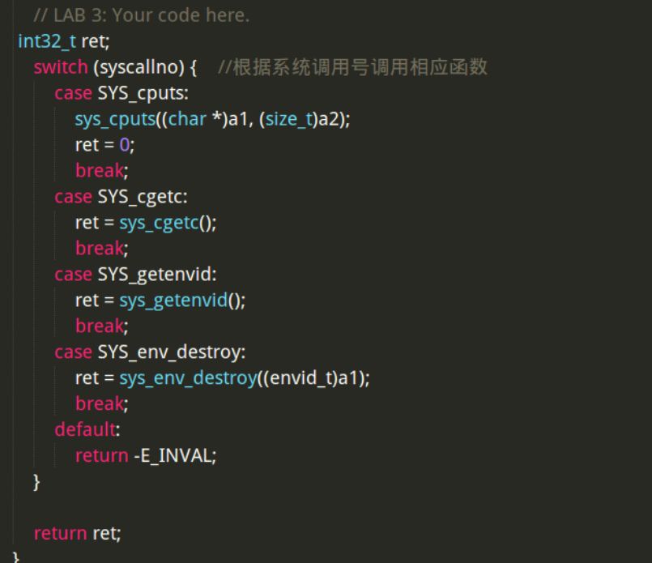

## **练习 8.**

**在用户库文件中补全所需要的代码，并启动你的内核。你应该能看到 `user/hello` 打出了 `hello, world` 和 `i am environment 00001000`。接下来，`user/hello` 尝试通过调用 `sys_env_destory()` 方法退出（在 `lib/libmain.c` 和 `lib/exit.c`）。因为内核目前只支持单用户进程，它应该会报告它已经销毁了这个唯一的进程并进入内核监视器。在这时，你应该能够在 `make grade` 中通过 `hello` 这个测试了。**

答：其实这个练习就是通过程序获得当前正在运行的用户环境的 env_id , 以及这个用户环境所对应的 Env 结构体的指针。 env_id 我们可以通过调用 sys_getenvid() 这个函数来获得。通过阅读 lib/env.h  文件我们知道，env_id的值包含三部分，第31位被固定为0；第10到30这21位是标识符，标示这个用户环境；第0~9位代表这个用户环境所采用的 Env 结构体，在envs数组中的索引。所以我们只需知道 env_id 的低 0~9 位，我们就可以获得这个用户环境对应的 Env 结构体了。

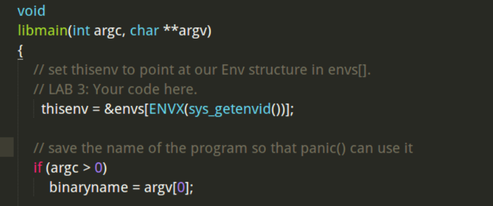

## **练习 9.**

**修改 `kern/trap.c`，如果缺页发生在内核模式，应该恐慌。**

 根据 CS 段寄存器的低2位 ，即 CPL 位 可以判断当前进程的权限访问级别，如果 page fault 是出现在内核态时，要把这个事件 panic 出来，所以把 page_fault_handler 文件修改如下： 


 继续完善 kern/pmap.c 文件中的 user_mem_assert , user_mem_check 函数，  user_mem_check 函数的功能是检查一下当前用户态程序是否有对虚拟地址空间 [va, va+len] 的 perm| PTE_P 访问权限。 先找到这个虚拟地址范围对应于当前用户态程序的页表中的页表项，然后再去看一下这个页表项中有关访问权限的字段，是否包含 perm | PTE_P，只要有一个页表项是不包含的，就代表程序对这个范围的虚拟地址没有 perm|PTE_P 的访问权限：

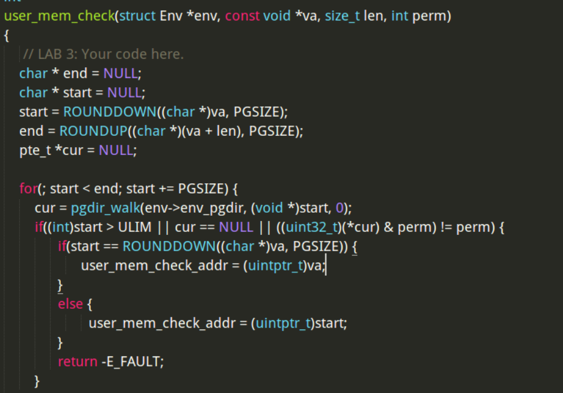

还要补全 sys_cputs  函数， 这个函数要求检查用户程序对虚拟地指空间 [s, s+len] 是否有访问权限 ，所以可以利用上面实现的 user_mem_assert ()函数来检查：

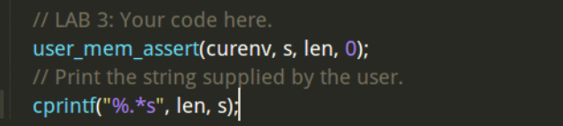

最后修改在 `kern/kdebug.c` 的 `debuginfo_eip`，对 `usd`, `stabs`, `stabstr` 都要调用 `user_mem_check`。修改之后，如果你运行 `user/breakpoint` ，你应该能在内核监视器下输入 `backtrace` 并且看到调用堆栈遍历到 `lib/libmain.c`

修改的`kern/kdebug.c` 的 `debuginfo_eip`代码


运行 make run-breakpoint,内核监视器下输入backtrace，能够看到 `lib/libmain.c` 前就发生了缺页，可能是由于 GCC 的优化，它没有遵守使我们这个功能得以正常工作的函数调用传统。

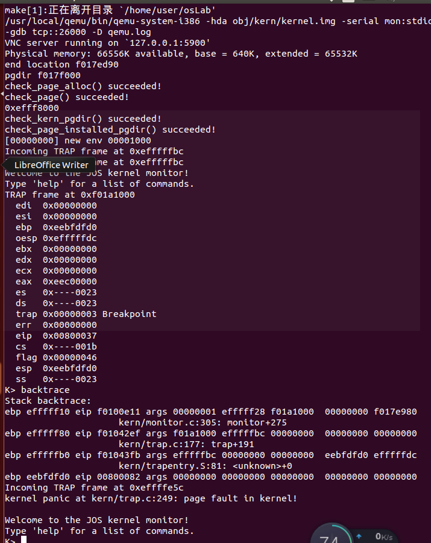

## **练习10**

启动你的内核，运行 `user/evilhello`。进程应该被销毁，内核不应该恐慌.


## **挑战 1！**

 **现在，无论是在 `trapentry.S` 中的 `TRAPHANDLER`，或者是配置它们的 `trap.c`中，你也许写了太多非常相似的代码了。试着整理一下。调整一下 `trapentry.S` 中的宏定义，让它自动生成一个给 `trap.c` 使用的表。注意，你可以在汇编中通过 `.text` 和 `.data` [(这是什么？)](https://en.wikipedia.org/wiki/Directive_(programming)) 来随时在代码段和数据段切换。**

整理相似代码，首先是`TRAPHANDLER`和 `TRAPHANDLER_NOEC`只有一个有无错误代码的差别，可以合并起来，然后在`trap.c`中原来是手动调用每一个`SETGATE`，可以在 `trapentry.S`声明一个数组来存下每个`TRAPHANDLER`，这样在`trap.c`中用一个循环就可以实现：

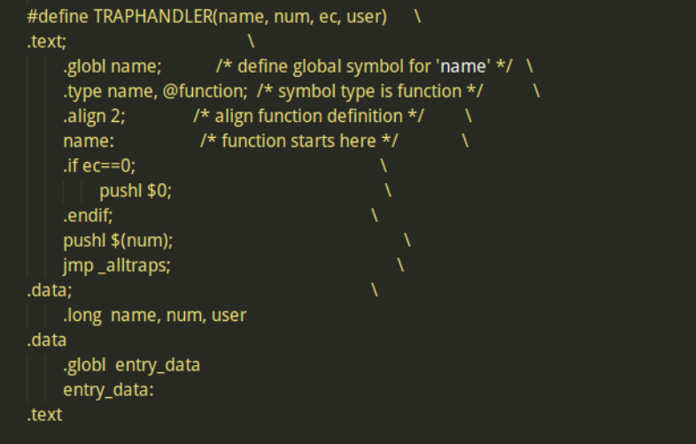

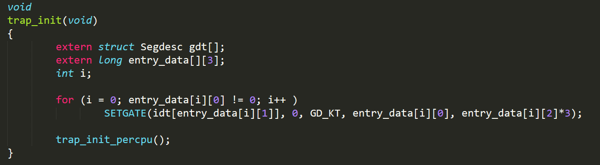

## **挑战 2！**

修改你的 JOS 内核，让你能够在断点之后从当前位置恢复运行，或者在断点之后继续单步运行。你需要理解 `EFLAGS` 中的某个特定的位来实现单步运行。

首先调整一下trap_dispatch()

```c
case T_BRKPT:
case T_DEBUG:
		monitor(tf);
		return;
```

让debug和breakpoint两种都能被捕捉到


然后这之后就会进入monitor中

```c
void monitor(struct Trapframe *tf)
{
        char *buf;

        cprintf("Welcome to the JOS kernel monitor!\n");
        cprintf("Type 'help' for a list of commands.\n");

        if (tf != NULL)
            print_trapframe(tf);

        while (1)
        {
            buf = readline("K> ");
            if (buf != NULL)
                if (runcmd(buf, tf) < 0)
                    break;
        }
}
```

我们来看看monitor的定义，如果tf不为空，那么说明当前监视器位于debug状态，会打印信息。然后在这时如果我们需要debug，需要编写两个函数

```c
int mon_continue(int argc, char **argv, struct Trapframe *tf)
{
        //关于EFLAGS寄存器的部分，发现了一个位：Trap Bit.
        //如果这个位被设置位1，那么每次执行一条指令，都会自动触发一次Debug Exception.
        if (tf == NULL)
        {
            cprintf("No Env is Running! This is Not a Debug Monitor!\n");
            return 0;
        }
        // Because we want the program to continue running; clear the TF bit
        tf->tf_eflags &= ~(FL_TF);
        return -1;
}
```

```c
int mon_stepi(int argc, char **argv, struct Trapframe *tf)
{
        if (tf == NULL)
        {
            cprintf("No Env is Running! This is Not a Debug Monitor!\n");
            return 0;
        }
        // Because we want the program to single step, set the TF bit
        tf->tf_eflags |= (FL_TF);
        return -1;
}

```

首先我们需要了解EFLAGS这个寄存器。这个寄存器中有Trap Bit.如果这个位被设置位1，那么每次执行一条指令，都会自动触发一次Debug Exception.因此我们要做的也很简单，在单步调试时给这一位置位，继续时把这一位清掉即可。

然后是在commands中添加函数入口，可以在monitor中输入

```c
static struct Command commands[] = {
        {"help", "Display this list of commands or one of the command", "help\nhelp <command>", mon_help},
        {"kerninfo", "Display information about the kernel", "kerninfo", mon_kerninfo},
        {"backtrace", "Display backtrace info", "backtrace", mon_backtrace},
        {"showmappings", "Display the permission of the vaddr between begin and end", "showmappings <begin> <end>", mon_showmapping},
        {"setperm", "set the permission of the virtual address bewteen begin and end",
         "setperm <begin> <end> <perm>", mon_setPrivilege},
        {"dump", "Display the contents between begin and end", "dump -p/-v <begin> <end>", mon_dump},
        {"stepi", "step", "stedpi", mon_stepi},
        {"continue", "continue", "continue", mon_continue},
};
```

运行效果如下：

我们使用make run-breakpoint

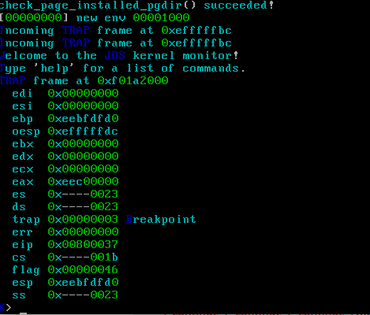

然后stepi

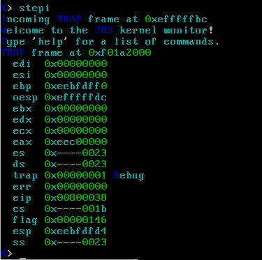

可以看到触发了debug但是还在调试模式中。

输入continue

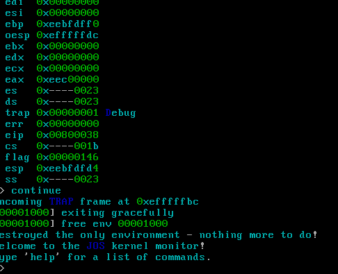

## **Make grade  !**

  
